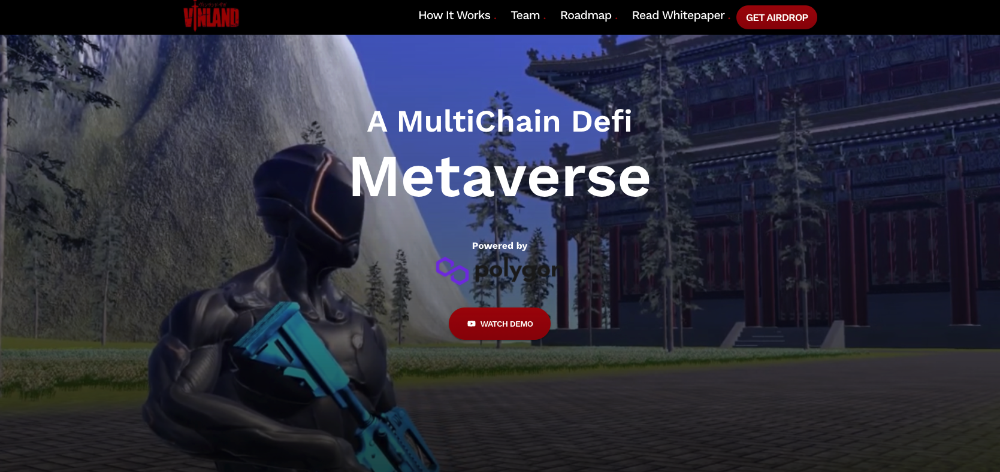

# Vinland - A MultiChain Defi Metaverse

Vinland is MultiChain Defi Metaverse where you can interact with many protocols in a gamified arena.

Following sections are developed:

1. Product Demo
2. Roadmap
3. Use cases
4. Product MVP
5. Team
6. Social Links

## Available Scripts

In the project directory, you can run:

### `yarn install`

This will install all the required dependencies in the app in the development mode.\
After installing all the dependencies you can run:

### `yarn start`

This will run the app in the development mode.\
Open [http://localhost:3000](http://localhost:3000) to view it in the browser.

The page will reload if you make edits.\
You will also see any lint errors in the console.

### `yarn build`

This will build the app for production to the `build` folder.\
It correctly bundles React in production mode and optimizes the build for the best performance.

The build is minified and the filenames include the hashes.\
Your app is ready to be deployed!

See the section about [deployment](https://facebook.github.io/create-react-app/docs/deployment) for more information.
